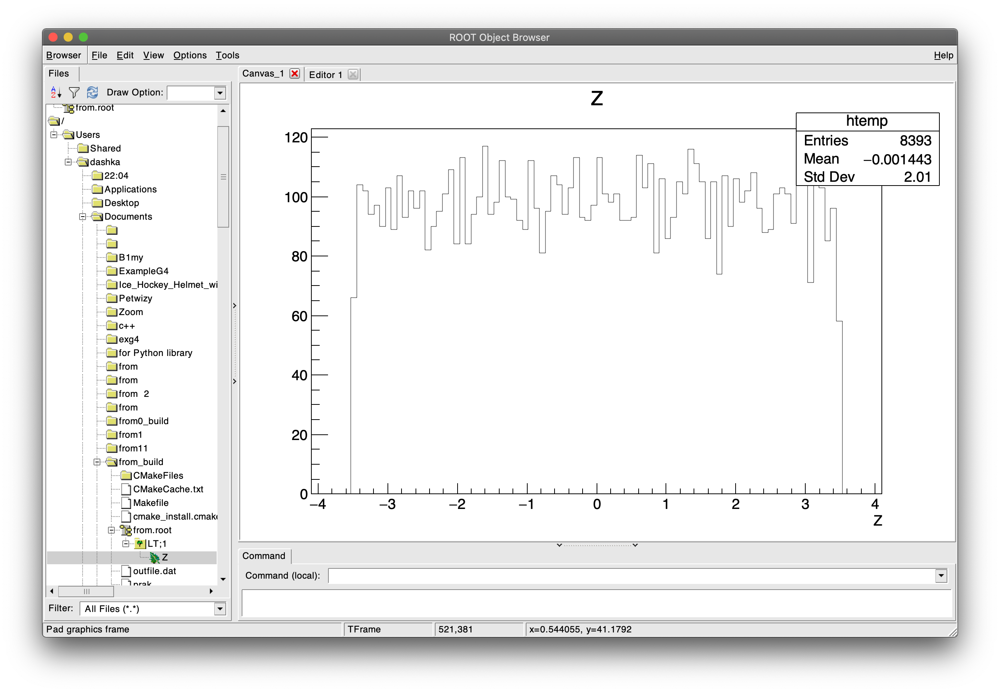
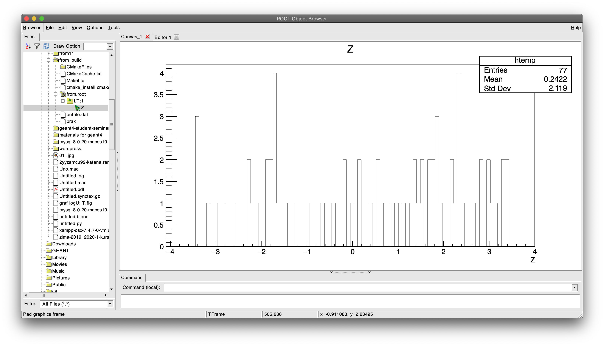
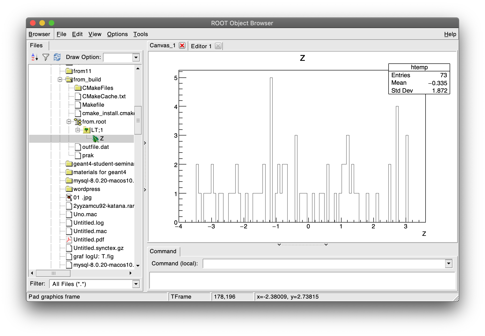
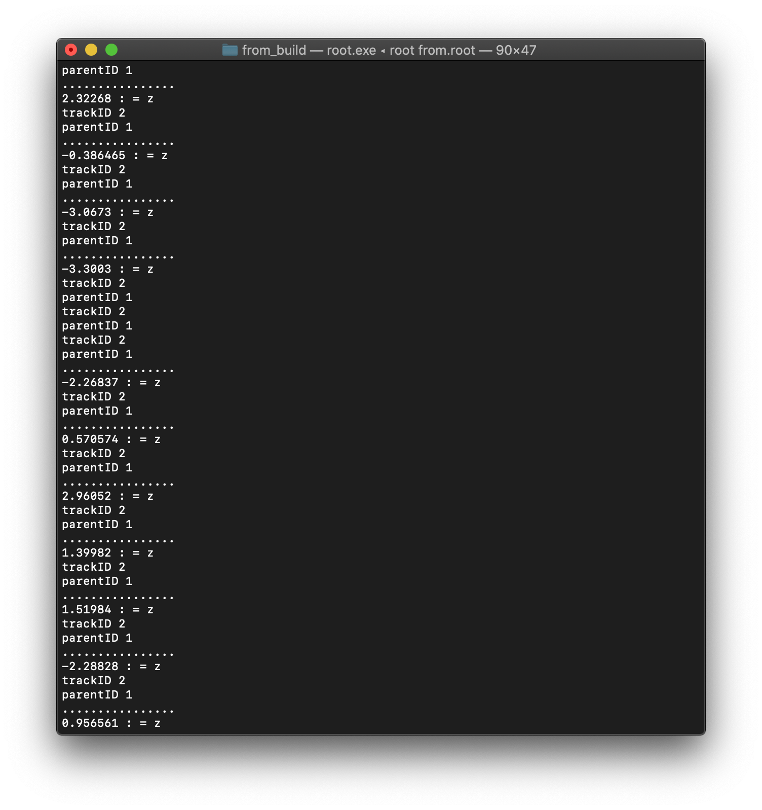
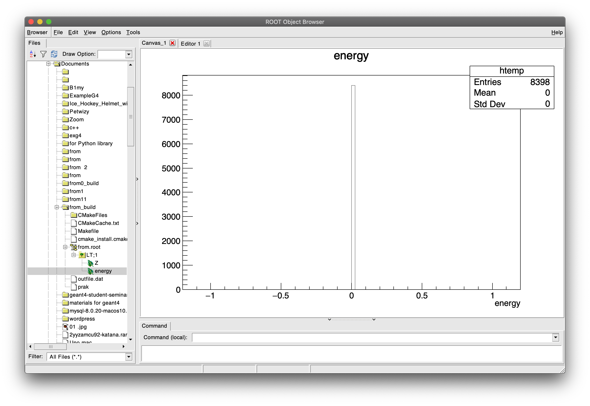

Тренировочная задача
--------------------------  

## Описание

На блок сцинтиллятора (полистерол 12х12х0.7 см) падают фотоны с энергией 400 кэВ. Надо построить распределение рожденных электронов по глублине (то есть по 0.7см).

## Замечания

1. Частицы запускала на расстоянии 6.5см от пластины;
2. В TrackingAction "ловила" электроны с TrackID> 1, которые появились в глубине пластинки + вывела их в терминале и руте;

## Результаты:

### при beamOn 100000

​

### при beamOn 1000

### Полученные гистограммы 
​
​

### Результаты в терминале 
​

## Результаты:

Процент фотонов, которые выбили электроны: 8%

Распределение энергии при 100 000 
​
